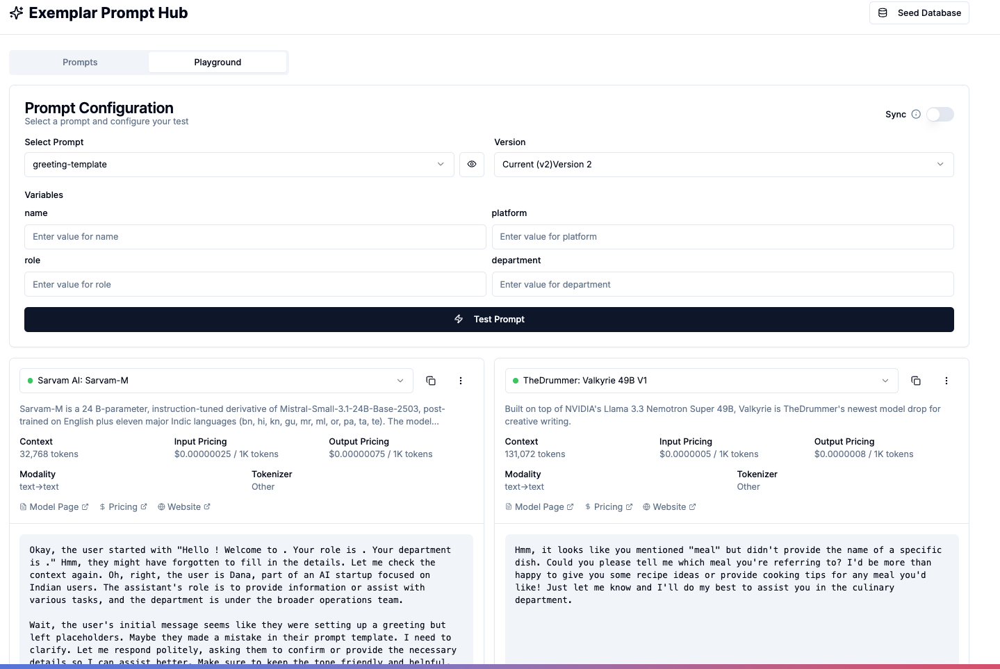

# Prompt management UI

## Overview

Exemplar Prompt Hub is a comprehensive prompt management system that helps you organize, version, and test your AI prompts.

## Backend Integration

This UI is designed to be used in conjunction with the [exemplar-prompt-hub](https://github.com/shubhanshusingh/exemplar-prompt-hub/) backend service.  
The backend provides a centralized REST API for managing, versioning, and retrieving AI prompts.  
For full functionality—including prompt storage, versioning, and multi-model playground—you should run both the backend and this UI together.

## Features



### Prompt Management
- **Create and Edit Prompts**: Easily create new prompts with names, descriptions, and tags
- **Version Control**: Track different versions of your prompts with version history
- **Tagging System**: Organize prompts with custom tags for better categorization
- **Search Functionality**: Quickly find prompts using search and tag filters
- **Metadata Support**: Add custom metadata to prompts for additional context

### Prompt Playground
- **Multi-Model Testing**: Test prompts across different AI models simultaneously
- **Variable Support**: Use dynamic variables in prompts with `{{variable}}` syntax
- **Side-by-Side Comparison**: Compare responses from different models
- **Model Selection**: Choose from various AI models including GPT-4 and Claude

### User Interface
- **Modern Design**: Clean and intuitive interface built with Next.js and Tailwind CSS
- **Responsive Layout**: Works seamlessly across different screen sizes
- **Real-time Updates**: Instant feedback on actions with toast notifications
- **Accessible Components**: Built with Radix UI for better accessibility

## Tech Stack

This project is built using modern web technologies:

- **Framework**: Next.js 15.2.4 with React 19
- **Styling**: Tailwind CSS with custom animations
- **UI Components**: 
  - Radix UI for accessible components
  - Lucide React for icons
  - Various UI components like Accordion, Dialog, Toast, etc.
- **Form Handling**: React Hook Form with Zod validation
- **Development**: TypeScript for type safety

## Project Structure

```
├── app/                 # Next.js app directory
├── components/         # Reusable UI components
├── lib/               # Utility functions and configurations
├── public/            # Static assets
├── styles/            # Global styles
└── hooks/             # Custom React hooks
```

## Running the Backend API

To use this UI, you must also run the [exemplar-prompt-hub](https://github.com/shubhanshusingh/exemplar-prompt-hub/) backend service.  
Follow the instructions in the backend repository to set up and start the API service.  
Typically, you can get started with:

```bash
git clone https://github.com/shubhanshusingh/exemplar-prompt-hub.git
cd exemplar-prompt-hub
cp .env.example .env
# Edit .env as needed
pip install -r requirements.txt
uvicorn app.main:app --reload
```

Make sure the backend API is running and accessible at the endpoint you configure in your `.env` file for this UI.

## Getting Started

1. Clone the repository
2. Install dependencies:
   ```bash
   npm install
   # or
   yarn install
   # or
   pnpm install
   ```
3. **Copy the example environment file and configure it:**
   ```bash
   cp .env.example .env
   ```
   Edit the `.env` file to set the correct API endpoint for your exemplar-prompt-hub backend service.
4. Run the development server:
   ```bash
   npm run dev
   # or
   yarn dev
   # or
   pnpm dev
   ```
5. Open [http://localhost:3000](http://localhost:3000) in your browser


## Available Scripts

- `npm run dev` - Start development server
- `npm run build` - Build for production
- `npm run start` - Start production server
- `npm run lint` - Run ESLint
